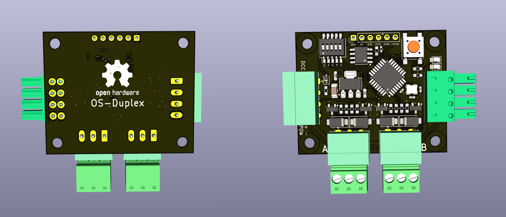
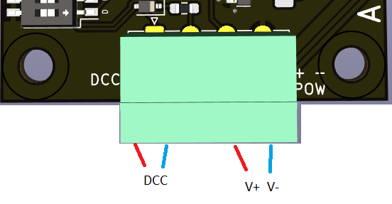
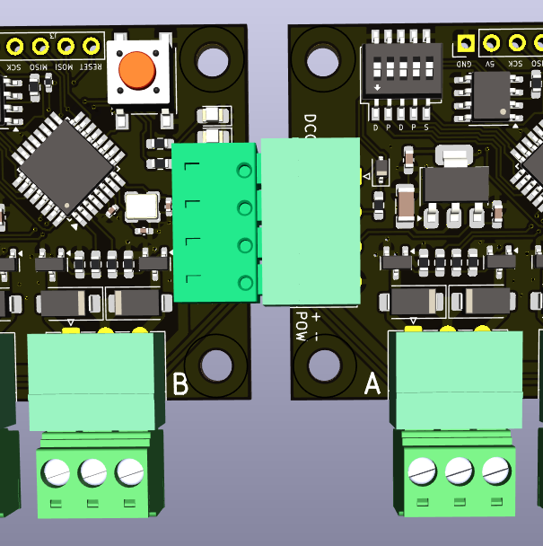
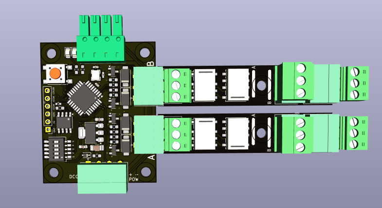
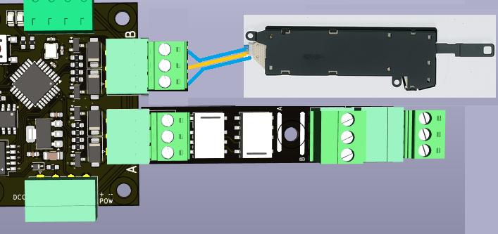
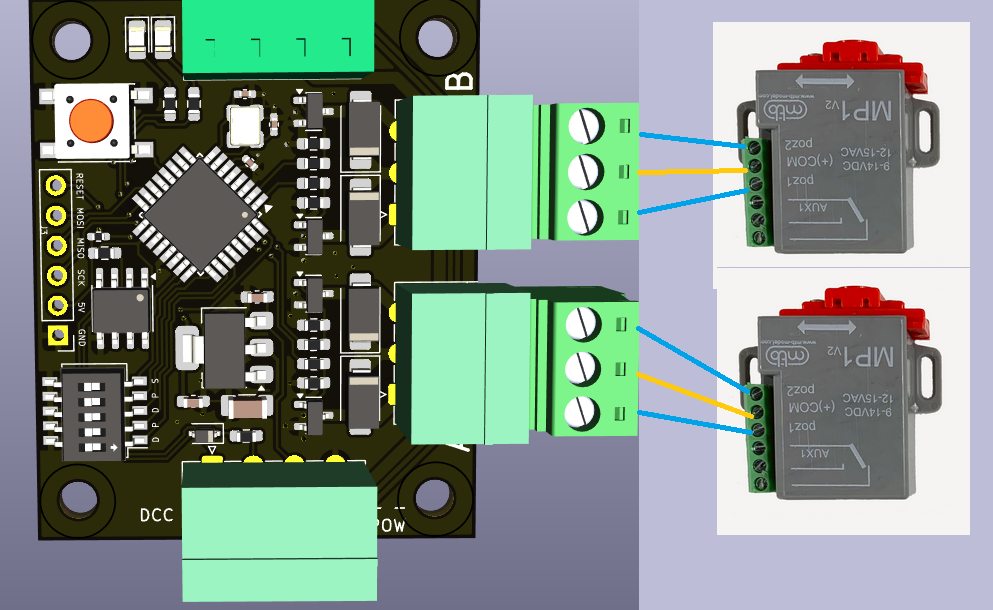
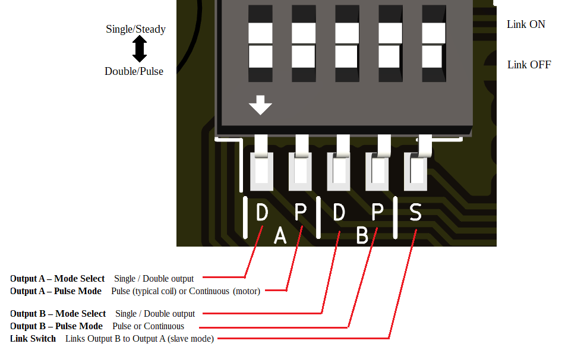
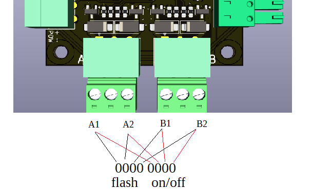
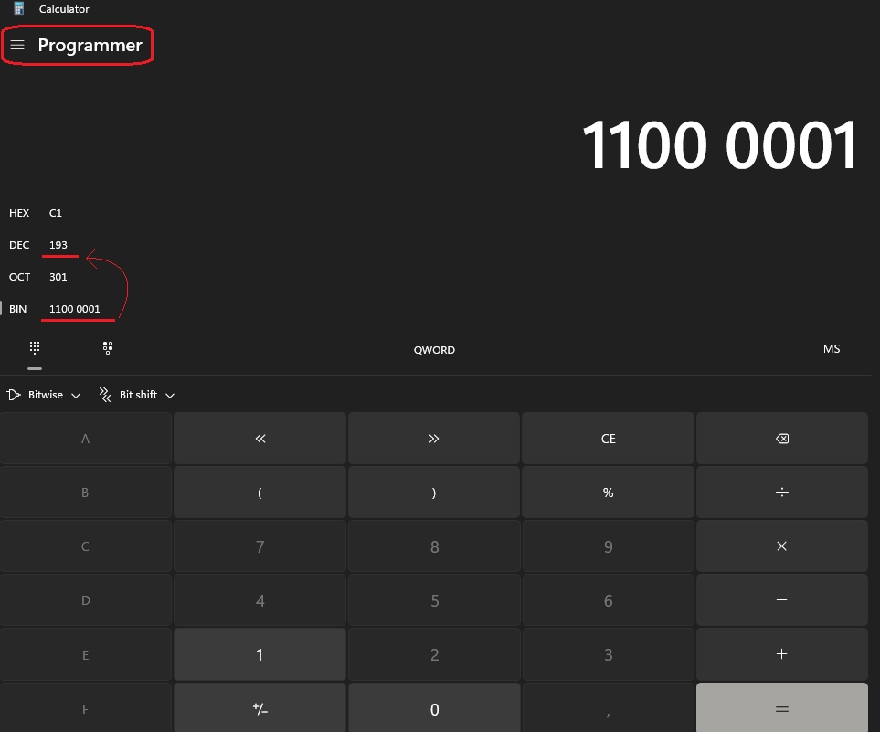
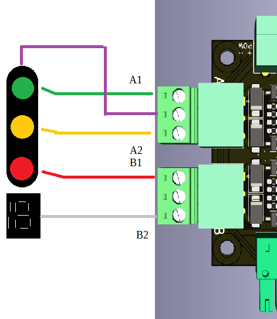

# ⚙️ OS-Duplex Decoder Manual

**Dual DCC decoder for solenoids, relays and turnout motors**

---

## 🔧 Introduction

The OS-Duplex is a dual DCC accessory decoder designed for all types of turnout drives — from traditional solenoids to motor drives and relay modules for frog polarization.  
Each side (A and B) can operate independently or be linked together.

Every side can act as either:
- 🅰️ / 🅱️ two independent single outputs (each with its own DCC address), or
- ⚙️ one combined double output for a twin-coil or motor drive turnout.

Optional relay sockets allow you to add point frog polarization, or use the same outputs to drive extra coils or motors.

---

## ⚡ Power Supply

The OS-Duplex requires an external DC power supply between 12 V and 18 V DC.  
⚠️ The polarity is absolute. Always observe correct “+” and “–” connections.

- Use lower voltages (12 V) for point motor drives  
- Use higher voltages (up to 18 V) for coil drives

---

## 🧩 Connections

- 🔌 DCC IN – Input for the DCC command signal  
- ⚡ POW + / POW - – Power inputs for each output section  
- ⚙️ OUT A / OUT B – Drive outputs for coils, motors, or relays  
- 🔌 Pass-Through Connectors – You can plug in more Duplex decoders in the following sockets  
- You can plug in up to four relay modules

*Figure 1: Main power terminals*

*Figure 2: 2 Duplex decoders daisy chained*

*Figure 3: 2 double relais modules plugged in*

*Figure 4: Example 1 Double Coil Drive and Double relay module*

*Figure 5: Example with 2x MTB MP-1*

---

## 🎚️ DIP-Switch Configuration

Five DIP switches define all operating modes:

1️⃣ Output A – Mode Select: Single / Double output  
2️⃣ Output A – Pulse Mode: Pulse (typical coil) or Continuous (motor)  
3️⃣ Output B – Mode Select: Single / Double output  
4️⃣ Output B – Pulse Mode: Pulse or Continuous  
5️⃣ Link Switch – Links Output B to Output A (slave mode). Only active if A is set to Double mode

---

## ⚙️ Operating Logic

### 🅰️ Output A (Primary)
- Works as single or double output
- In double mode, one DCC address controls both output, whether they are pulsed or steady
- In single mode, each output uses its own address

### 🅱️ Output B (Secondary)
- May run independently like A or as slave to A
- In linked operation, B can automatically handle frog polarization; it switches the relays and point motor in a specific sequence to prevent shorts from occuring:
    1. De-energize frog
    2. Switch turnout
    3. Re-energize frog with opposite polarity

This timing supports Electrofrog and Uni-frog layouts

---

## 🔗 Slave Mode Extensions

### Signal mode

When the link is enabled between the outputs, Output B changes behavior depending on A’s mode:
- If A is Single + Pulse, the decoder accepts DCC Extended commands for 4-lamp signals  
- Both outputs act together as a miniature signal controller  
- The Duplex has no concept of settings, aspects of pre-sets when it comes to signals. Instead we use the DCC-extended commands with which we can transmitt a value of 0 - 255 to the decoder

The value works in binary, 255 has a binary value of 1111 1111. The first ones tell which LEDs need to flash, the 2nd set tells if lights need to be on or off. When a light is set to flash with the first nibble, the corresponding bit in the 2nd nipple need to be a '0'. **For example, when only the first 2 light have to flash, the 3rd light is off and the the 4th light is on, the value would be 1100 0001 or 193 decimal.**

The computer program that you use for your model railway layout need to link the signal's aspects and DCC EXT values. You need to write down the binary value to match with your desired aspect and then calculate the decimal value. You can make use of window's native calculator tool. Put the calculator in Programmer mode first.

As example we take a Dutch main Line signal. We connect green to A1, yellow to A2, red to B1 and the number box to B2. Purple is the common + lead

This signal uses these aspects. 

| Aspect | Lamps (G/Y/R/W) | High nibble (flash bits) | Low nibble (on/off bits) | Decimal |
|--------|-----------------|------------------------|-------------------------|---------|
| Stop | R | 0000 | 0100 | 4 |
| Proceed | G | 0000 | 0001 | 1 |
| Caution / Expect stop | Y | 0000 | 0010 | 2 |
| Drive on sight (Y flashing) | Y (flash) | 0010 | 0000 | 32 |
| Diverging / speed route (G flashing) | G (flash) | 0001 | 0000 | 16 |
| Speed indicated at this signal (G flashing + W ON) | G (flash) + W ON | 0001 | 1000 | 24 |
| Approach with speed at next signal (Y + W ON) | Y ON + W ON | 0000 | 1010 | 10 |

---

## 💡 Technical Notes

- Compatible with Roco, NMRA, and extended DCC addressing
- Each output can safely source standard turnout coils or small motors
- EEPROM stores last configuration and addresses
- Firmware supports address learning via DCC command or button input (if implemented)

---

## 🧰 Safety & Recommendations

- Always verify correct supply polarity before powering
- Do not exceed 18 V DC
- Keep adequate spacing if driving four high-current relays simultaneously
- Use a proper DC supply with current capability matching your turnout type

---

## Appendix A, DIP switch combinations

### Individual outputs        

| Dipswitches | Description |
|------------|-------------|
| 00000 | A = Double Pulse, B = Double Pulse |
| 00010 | A = Double Pulse, B = Double Steady |
| 00110 | A = Double Pulse, B = Single Steady |
| 01000 | A = Double Steady, B = Double Pulse |
| 01010 | A = Double Steady, B = Double Steady |
| 01110 | A = Double Steady, B = Single Steady |
| 11000 | A = Single Steady, B = Double Pulse |
| 11010 | A = Single Steady, B = Double Steady |
| 11110 | A = Single Steady, B = Single Steady |

### Output B linked to output A

| Dipswitches | Description |
|------------|-------------|
| 00001 | A = Double Pulse, B = Double Relay |
| 00101 | A = Double Pulse, B = Single Relay |
| 01001 | A = Double Steady, B = Double Relay |
| 01101 | A = Double Steady, B = Single Relay |
| 10001 | Signal mode |

---

📘 *End of Manual*
