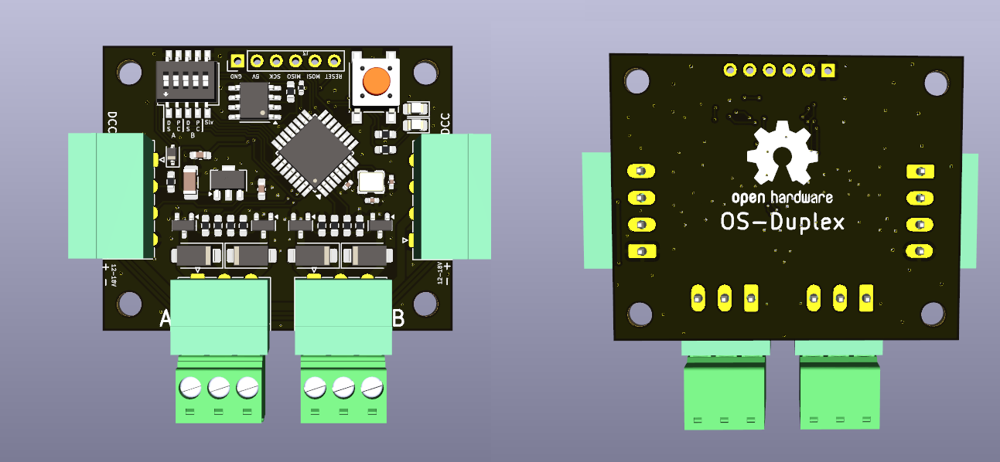
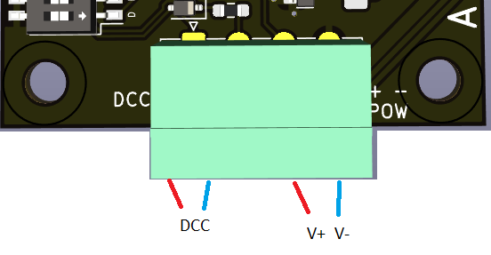
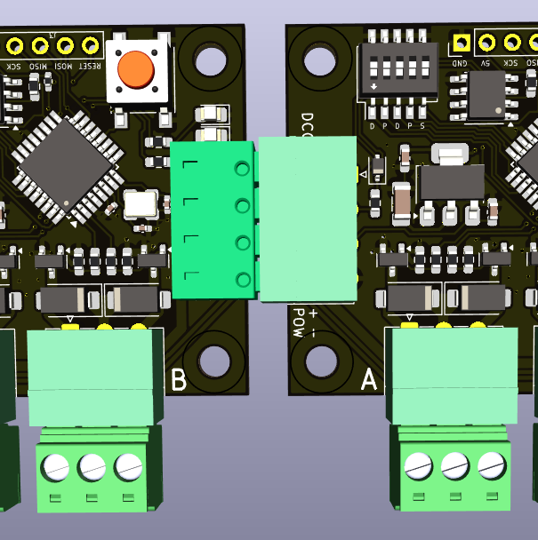
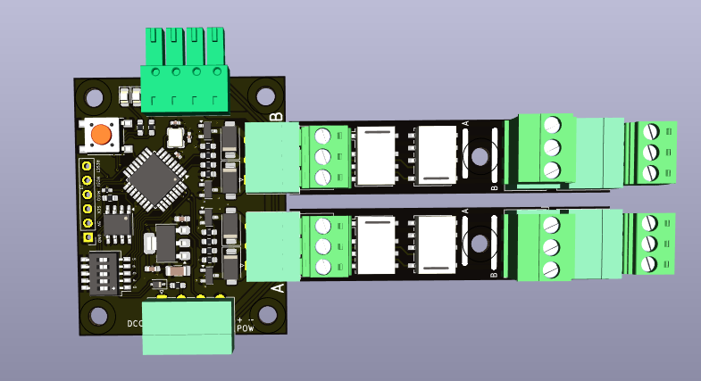
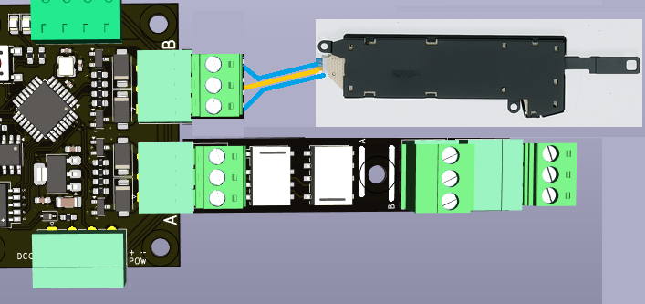
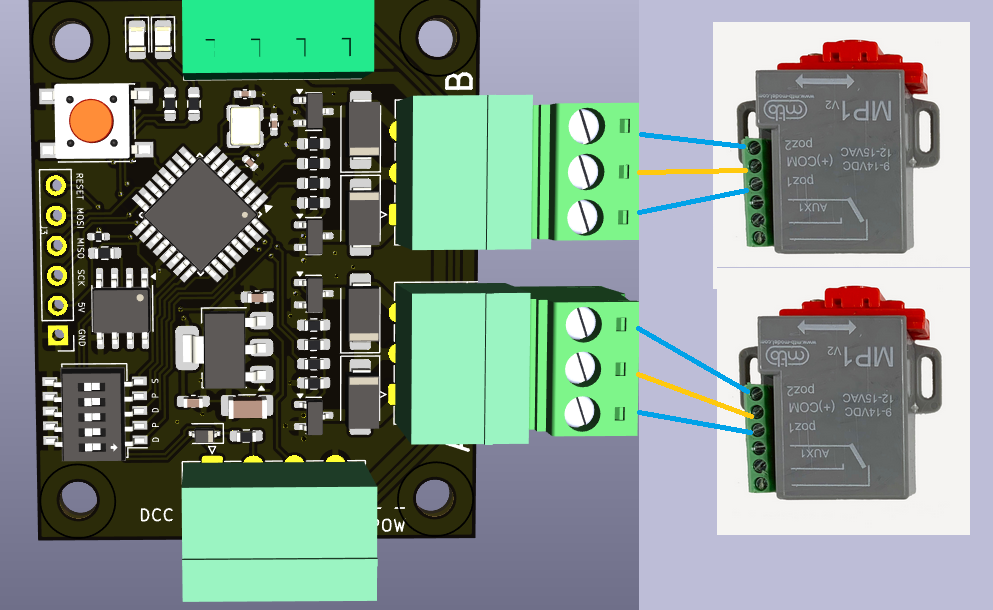
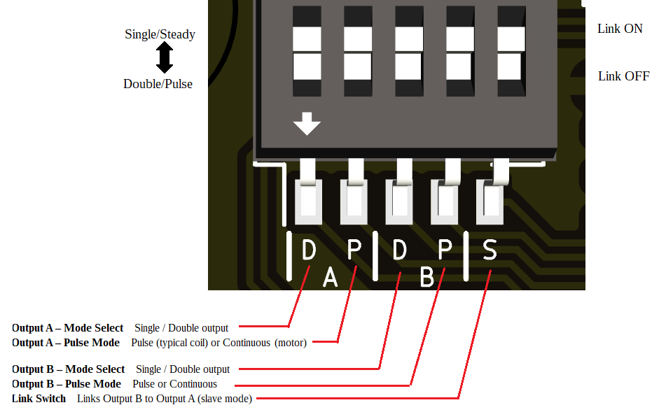
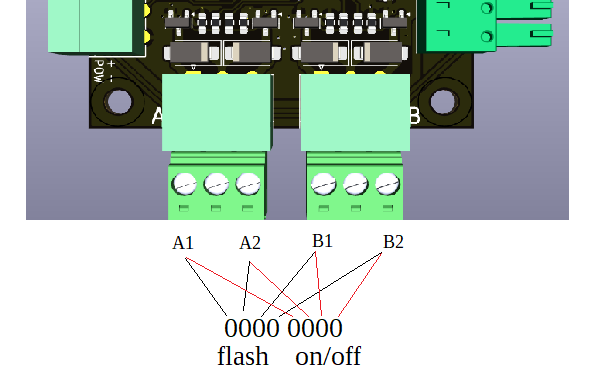
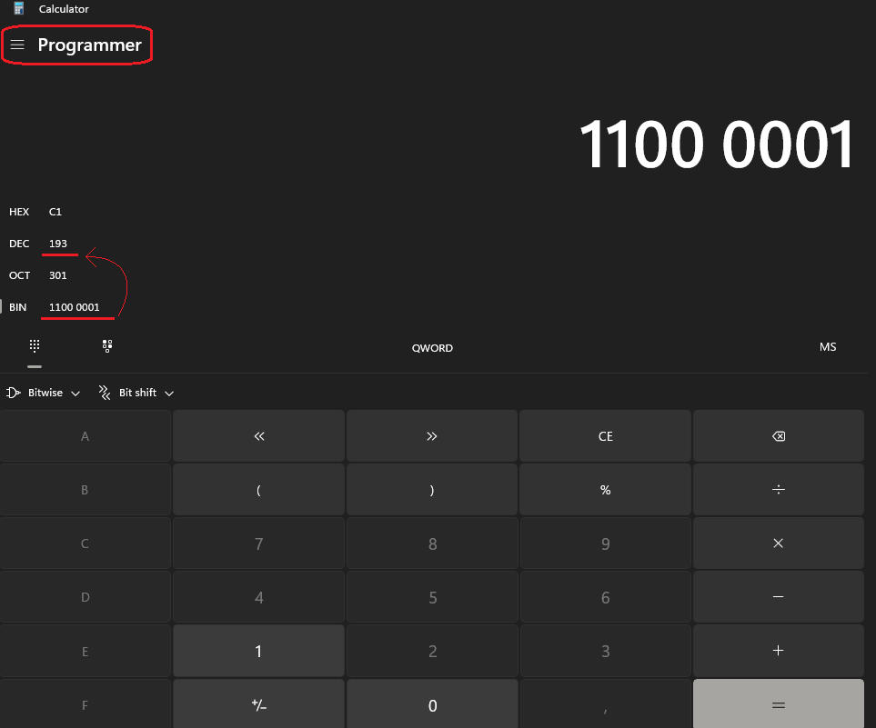
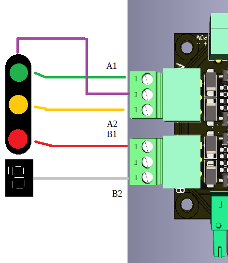

> 🌐 &nbsp; [🇬🇧 EN](Manual-EN.md) &nbsp;|&nbsp; [🇩🇪 DE](Manual-DE.md) &nbsp;|&nbsp; [🇫🇷 FR](Manual-FR.md) &nbsp;|&nbsp; [🇳🇱 NL](Manual-NL.md) &nbsp;|&nbsp; [🇪🇸 ES](Manual-ES.md) &nbsp;|&nbsp; [🇮🇹 IT](Manual-IT.md) &nbsp;|&nbsp; 🇵🇱 PL &nbsp;|&nbsp; [🇨🇿 CS](Manual-CS.md) &nbsp;|&nbsp; [🇩🇰 DA](Manual-DA.md) &nbsp;|&nbsp; [🇳🇴 NO](Manual-NO.md) &nbsp;|&nbsp; [🇸🇪 SV](Manual-SV.md) &nbsp;|&nbsp; [🇭🇺 HU](Manual-HU.md) &nbsp;|&nbsp; [🇵🇹 PT](Manual-PT.md)

# ⚙️ Instrukcja dekodera OS-Duplex

**Podwójny dekoder DCC do solenoidów, przekaźników i silników zwrotnic**

---

## 🔧 Wprowadzenie

OS-Duplex to dwukanałowy akcesoria dekoder DCC przeznaczony do wszystkich typów napędów zwrotnicowych — od tradycyjnych solenoidów po napędy silnikowe i moduły przekaźnikowe do polaryzacji sercówek.  
Każda strona (A i B) może pracować niezależnie lub być ze sobą połączona.

Każda strona może działać jako:
- 🅰️ / 🅱️ dwa niezależne pojedyncze wyjścia (każde z własnym adresem DCC), lub
- ⚙️ jedno połączone podwójne wyjście dla napędu zwrotnicy z podwójną cewką lub napędu silnikowego.

Opcjonalne gniazda przekaźnikowe umożliwiają dodanie polaryzacji sercówki lub użycie tych samych wyjść do sterowania dodatkowymi cewkami lub silnikami.

---

## ⚡ Zasilanie

OS-Duplex wymaga zewnętrznego zasilania DC między 12 V a 18 V DC.  
⚠️ Biegunowość jest bezwzględna. Zawsze zachowuj prawidłowe podłączenie „+" i „–".

- Używaj niższych napięć (12 V) do napędów silnikowych zwrotnic  
- Używaj wyższych napięć (do 18 V) do napędów cewkowych

---

## 🧩 Podłączenia

- 🔌 DCC IN – Wejście sygnału polecenia DCC  
- ⚡ POW + / POW - – Wejścia zasilania dla każdej sekcji wyjściowej  
- ⚙️ OUT A / OUT B – Wyjścia sterujące cewkami, silnikami lub przekaźnikami  
- 🔌 Złącza przelotowe – Możesz podłączyć kolejne dekodery Duplex w następnych gniazdach  
- Możesz podłączyć do czterech modułów przekaźnikowych

*Rysunek 1: Główne zaciski zasilające*

*Rysunek 2: 2 dekodery Duplex połączone łańcuchowo*

*Rysunek 3: 2 podwójne moduły przekaźnikowe podłączone*

*Rysunek 4: Przykład 1 — napęd podwójną cewką i podwójny moduł przekaźnikowy*

*Rysunek 5: Przykład z 2× MTB MP-1*

---

## 🎚️ Konfiguracja przełączników DIP

Pięć przełączników DIP definiuje wszystkie tryby pracy:

1️⃣ Wyjście A – Wybór trybu: pojedyncze / podwójne wyjście  
2️⃣ Wyjście A – Tryb impulsowy: impuls (typowa cewka) lub ciągły (silnik)  
3️⃣ Wyjście B – Wybór trybu: pojedyncze / podwójne wyjście  
4️⃣ Wyjście B – Tryb impulsowy: impuls lub ciągły  
5️⃣ Przełącznik łączący – Łączy wyjście B z wyjściem A (tryb slave). Aktywny tylko jeśli A jest ustawione na tryb podwójny

---

## ⚙️ Logika działania

### 🅰️ Wyjście A (główne)
- Działa jako pojedyncze lub podwójne wyjście
- W trybie podwójnym jeden adres DCC steruje oboma wyjściami, niezależnie od tego, czy są impulsowane, czy ciągłe
- W trybie pojedynczym każde wyjście używa własnego adresu

### 🅱️ Wyjście B (pomocnicze)
- Może działać niezależnie jak A lub jako slave wyjścia A
- W trybie powiązanym B może automatycznie obsługiwać polaryzację sercówki; przełącza przekaźniki i silnik zwrotnicy w określonej kolejności, aby zapobiec zwarciom:
    1. Odłączenie zasilania sercówki
    2. Przełączenie zwrotnicy
    3. Ponowne zasilenie sercówki z przeciwną biegunowością

Ta sekwencja obsługuje układy z Electrofrog i Uni-frog

---

## 🔗 Rozszerzenia trybu slave

### Tryb semaforowy

Gdy łącze między wyjściami jest aktywne, wyjście B zmienia zachowanie w zależności od trybu A:
- Jeśli A jest w trybie pojedynczym + impulsowym, dekoder akceptuje rozszerzone polecenia DCC EXT dla semaforów 4-lampowych  
- Oba wyjścia działają razem jako miniaturowy sterownik semafora  
- OS-Duplex nie posiada pojęcia stałych ustawień, aspektów ani szablonów dla semaforów. Zamiast tego używamy poleceń DCC EXT, za pomocą których możemy przesłać do dekodera wartość 0–255.

Wartość działa w systemie binarnym. 255 ma wartość binarną `1111 1111`. Wysoka tetrada (pierwsze 4 bity) określa, które LED powinny migać; niska tetrada (ostatnie 4 bity) określa, które lampki powinny być włączone lub wyłączone. Gdy lampka jest ustawiona na miganie przez wysoką tetradę, odpowiadający jej bit w niskiej tetradzie musi wynosić `0`. **Na przykład, gdy tylko pierwsze dwie lampki powinny migać, trzecia jest wyłączona, a czwarta jest włączona: wartość to `1100 0001` = 193 dziesiętnie.**

Oprogramowanie używane do sterowania makietą kolejową musi powiązać aspekty semafora z wartościami DCC EXT. Zapisz wartość binarną każdego żądanego aspektu, a następnie oblicz jej odpowiednik dziesiętny. Pomocny może być wbudowany kalkulator systemu Windows — przełącz go najpierw w tryb **Programista**.

Jako przykład weźmiemy holenderski semafory linii głównej. Podłączamy zielony do A1, żółty do A2, czerwony do B1, a skrzynkę numeryczną do B2. Fioletowy to wspólny przewód +.

Ten semafor używa następujących aspektów.

| Aspekt | Lampki (G/Y/R/W) | Wysoka tetrada (bity migania) | Niska tetrada (bity wł./wył.) | Dziesiętnie |
|--------|-----------------|------------------------|-------------------------|---------|
| Stój | R | 0000 | 0100 | 4 |
| Jedź | G | 0000 | 0001 | 1 |
| Ostrożnie / Oczekuj zatrzymania | Y | 0000 | 0010 | 2 |
| Jedź z ograniczoną prędkością (Y miga) | Y (miga) | 0010 | 0000 | 32 |
| Odgałęzienie / trasa z prędkością (G miga) | G (miga) | 0001 | 0000 | 16 |
| Prędkość wskazana na tym semaforze (G miga + W wł.) | G (miga) + W wł. | 0001 | 1000 | 24 |
| Dojedź z prędkością do następnego semafora (Y + W wł.) | Y wł. + W wł. | 0000 | 1010 | 10 |

---

## 💡 Uwagi techniczne

- Kompatybilny z adresowaniem DCC Roco, NMRA i rozszerzonym
- Każde wyjście może bezpiecznie zasilać standardowe cewki zwrotnicowe lub małe silniki
- EEPROM przechowuje ostatnią konfigurację i adresy
- Oprogramowanie układowe obsługuje uczenie adresów przez polecenie DCC lub przycisk (jeśli zaimplementowano)

---

## 🧰 Bezpieczeństwo i zalecenia

- Przed włączeniem zasilania zawsze sprawdź prawidłową biegunowość zasilacza
- Nie przekraczaj 18 V DC
- Zachowaj odpowiednie odstępy przy jednoczesnym sterowaniu czterema przekaźnikami dużych prądów
- Używaj odpowiedniego zasilacza DC o wydajności prądowej dostosowanej do rodzaju zwrotnicy

---

## Załącznik A — kombinacje przełączników DIP

### Niezależne wyjścia        

| Przełączniki DIP | Opis |
|------------|-------------|
| 00000 | A = Double Pulse, B = Double Pulse |
| 00010 | A = Double Pulse, B = Double Steady |
| 00110 | A = Double Pulse, B = Single Steady |
| 01000 | A = Double Steady, B = Double Pulse |
| 01010 | A = Double Steady, B = Double Steady |
| 01110 | A = Double Steady, B = Single Steady |
| 11000 | A = Single Steady, B = Double Pulse |
| 11010 | A = Single Steady, B = Double Steady |
| 11110 | A = Single Steady, B = Single Steady |

### Wyjście B powiązane z wyjściem A

| Przełączniki DIP | Opis |
|------------|-------------|
| 00001 | A = Double Pulse, B = Double Relay |
| 00101 | A = Double Pulse, B = Single Relay |
| 01001 | A = Double Steady, B = Double Relay |
| 01101 | A = Double Steady, B = Single Relay |
| 10001 | Tryb semaforowy |

---

📘 *Koniec instrukcji*
